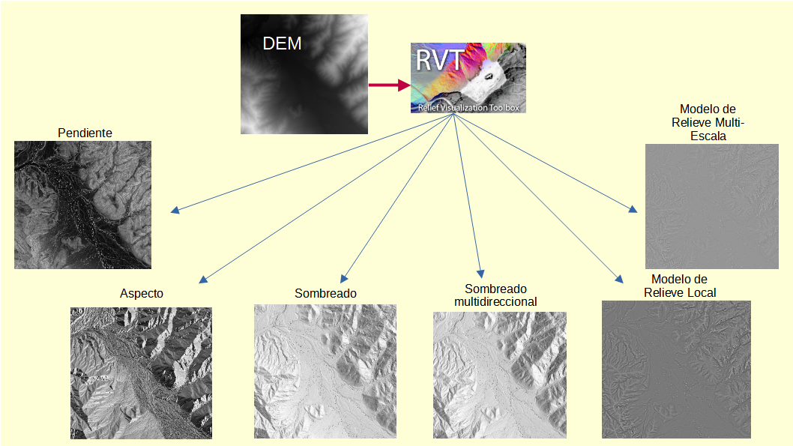

# Relief Visualization Toolbox RVT 

La herramienta está disponible en https://github.com/EarthObservation/RVT_py. En este repositorio se está incluyendo las pruebas realizadas a partir de un DEM de ejemplo.

Se continuarán las pruebas para ir generando nuevas visualizaciones, espero que lo puedan probar también.
